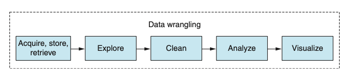
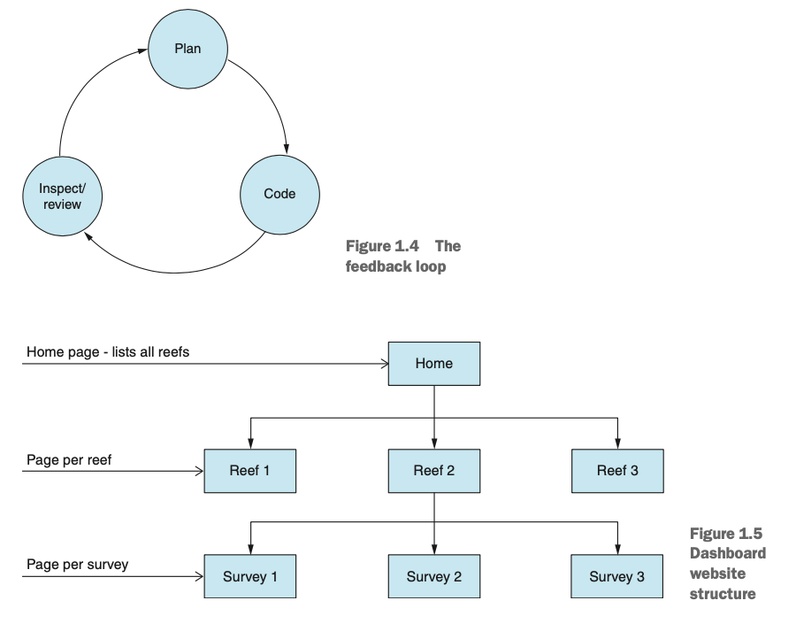
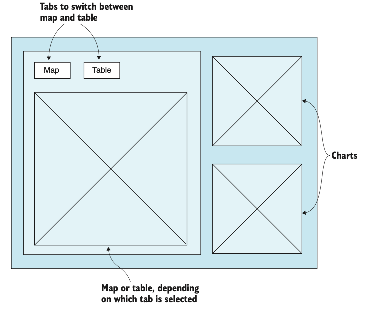
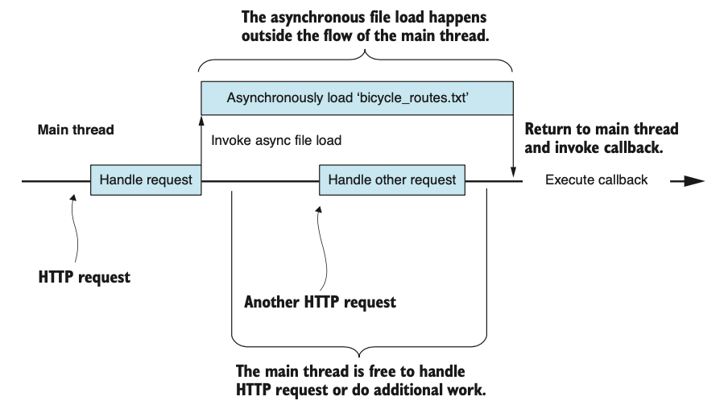
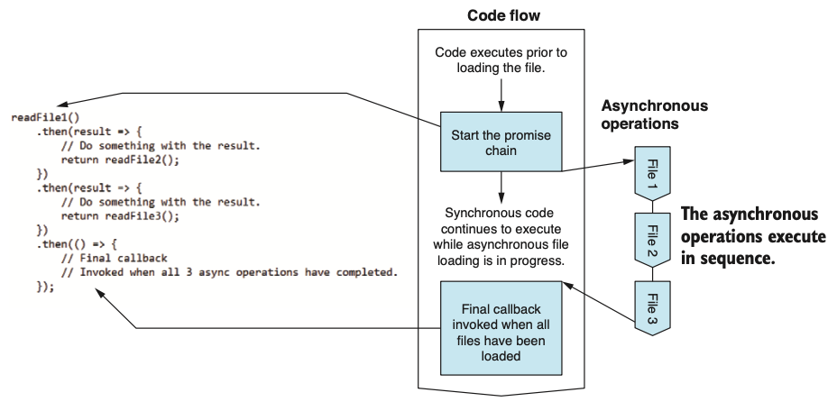
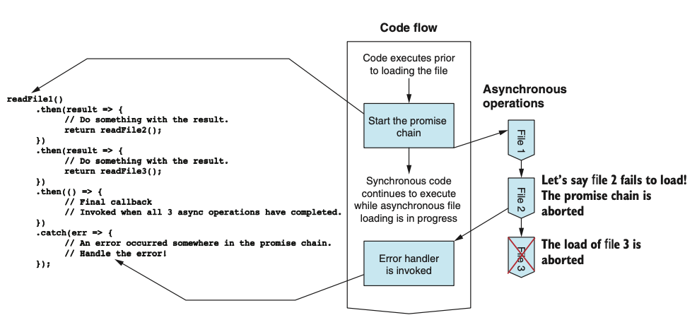
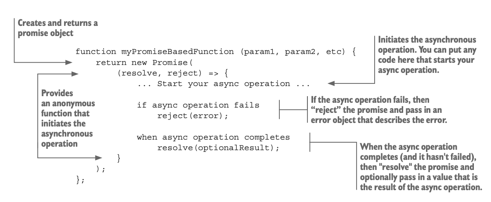

# DATA WRANGLING USING JAVASCRIPT

## C1 - Getting started: establishing your data pipeline



(3) Data wrangling involves wrestling with many different issues. How can you filter or optimize data, so you can work with it more effectively? How can you improve your code to process the data more quickly? How do you work with your language to be more effective? How can you scale up and deal with larger data sets?

(8) Mocha with Chai for JavaScript unit and integration testing.
Collection of Data: Linq (from C#)
Working with time: Moment.JS

(10) The biggest problem I see in many programmers is their failure to think and plan out their work before coding.
(11) If you don’t have enough information to plan, then move forward with exploratory coding and return to planning when you have a better understanding of the problem you’re trying to solve.
Requirements usually change over time as you develop your understanding of the proj- ect. Don’t be concerned if this happens.
>
>
>

(15) Exploratory coding is the process of incrementally building your code through an iterative and interactive process (figure 1.10). Code a few lines, then run the code and inspect the output, repeat. Repeating this process builds up your code and understand- ing at the same time.

## C2 - Working with Node JS

### 1. Working with Node

(35) You might wonder why you need to install dependencies for such a simple code example. Well, truth be told—you don’t! I want you to get in the habit of doing this because most examples do have dependencies and you do need to run npm install to download the dependencies before you run the code.

>**Use Strict**
This statement was introduced in ECMAScript 5 and allows you to opt in to a more restricted and safer version of the language.

```js
npm install --save moment
```

Note the --save parameter saves the dependency in package.json and tracks the ver- sion number

**_Creating a command line app_**
(37) Uses yargs for access to command-line arguments
Uses chai for its assert library for validation

```js
"use strict";

const yargs = require('yargs');
const argv = yargs.argv;
const assert = require('chai').assert;
```

**_Creating a code library_**
(38) Exports the function so that it can be reused in other code module. The code module can now be imported into your command-line app (or indeed any other code module) using Node’s _require_ function

```js
"use strict";
function generateReport (data) {
    const columns = Object.keys(data[0]); 
    return {
        numRows: data.length, numColumns: columns.length, columnNames: columns,
    };
};
module.exports = generateReport;
```

---
In other code module:

```js
...
const generateReport = require(‘./generate-report.js’);
const report = generateReport(data);
...
```

---

We can also export an object, and this allows us to export a library of functions.

```js
module.exports = {
    someFunction1: function (param1, param2, etc) {
    //
    // Code //
    // Return result
    },
    someFunction2: function (param1, param2, etc) { //
    // Code //
    // Return result
    },
    ...
};
```

### 2. Creating a simple web server

Using Express:

```bash
npm install -–save express
```

### 3. Adding a REST API

(43) Define a handler for the route /rest/data

```js
app.get("/rest/data", (req, res) => { const report = generateReport(data); res.json(report);
});
```

(44) Then we can use jQuery or 

```js
<script>
$.getJSON("/rest/data", function (report) { 
    document.write(
        "Num rows: " + report.numRows + "\r\n" +
        "Num columns: " + report.numColumns + "\r\n" + "Columns: " + report.columns.join(', ')
    );
});
</script>
```

$.getJSON() ~ $.ajax({})

(47) In other languages and environments where synchronous coding is normal, we can avoid this problem by delegating such resource-intensive operations to a worker thread. Generally, though, we can’t use threads like this in Node.js, which is typically consid- ered to be single-threaded.

A callback is a JavaScript function that’s automatically called for you when a single asynchronous operation has completed.



(52) Asynchronous coding with promises (Promise design pattern) dealing with the following problems of callbacks:

- Callback Hell
- Callback Order
- Error Handling

>**A promise** is an object that wraps an asynchronous operation and promises to deliver an outcome (or an error) at some time in the future.
Promises give us a vocabulary to express chains of asynchronous operations in a way that almost looks (if you squint your eyes) like it was a sequence of synchronous operations.

_**THEN**_

Then is used to chain together a sequence of asynchronous operations

>

_**ALL**_

Promise.all is used to manage asynchronous operations that are running in paral- lel. It automatically weaves together the callbacks and invokes a single final callback (figure 2.22). Using all, you no longer need to worry about coordinating multiple callbacks that might be invoked in any order.

_**CATCH**_

Using promises, we can attach an error handler to the end of our chain



>Always have at least 1 error handler

### 4. Wrapping async ops in promises

(55) We instantiate a Promise object with an anonymous function that initiates the asyn- chronous file loading operation. The anonymous function is passed two parameters. The first parameter is a resolve function that we call when the asynchronous operation has completed and we’re ready to resolve the promise. This will trigger the next then handler that is chained to the promise. The second parameter is a reject function that we can call if an error occurs. We can use this to fail the promise and trigger the closest catch handler in the promise chain:



### 5. Async code with async and await

## C3 - Acquisition, storage and retrieval


