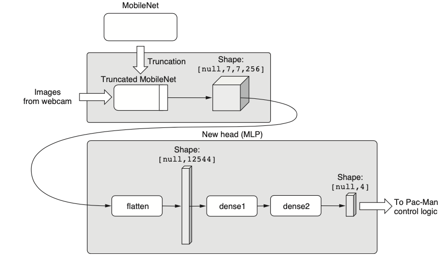
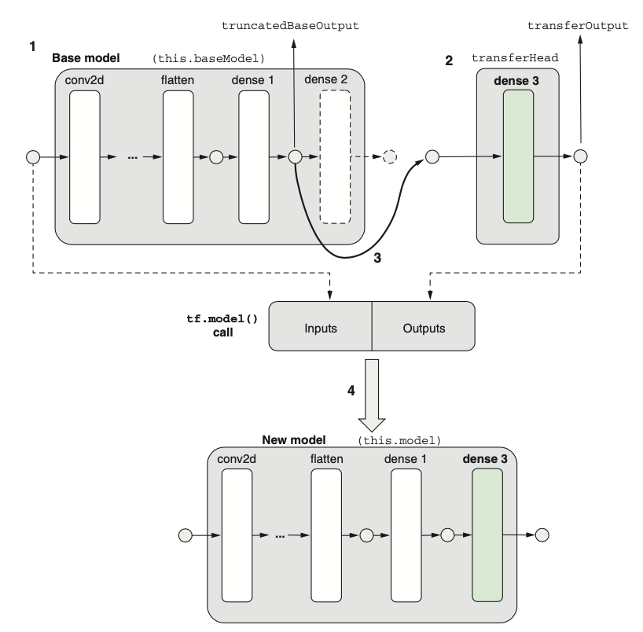
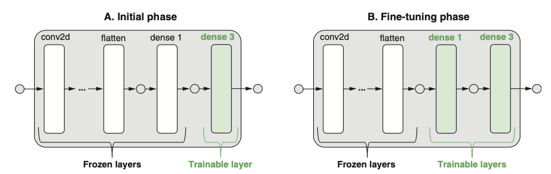
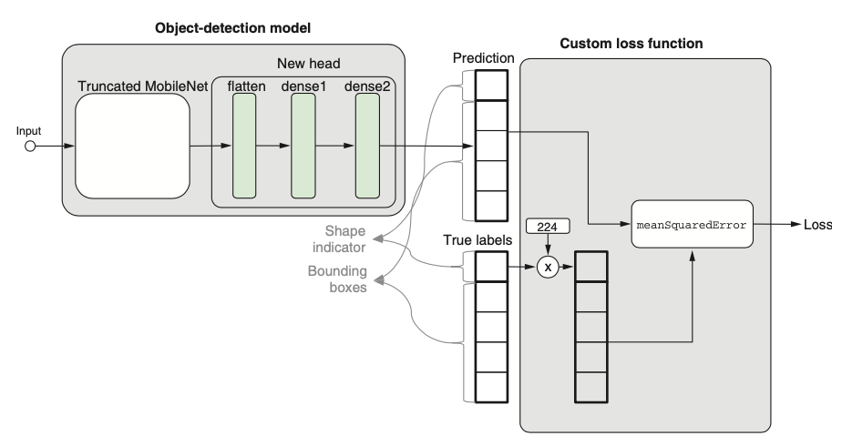

# DEEP LEARNING IN TENSORFLOW JS EBOOK

## PART I: INTRODUCTION TO DL IN JS

### C1 - Deep Learning and Javscript

Backpropagation demo scrollytelling illustration: <http://mng.bz/2J4g>
 Stanford CS231 lecture 4 course notes on backpropagation: <http://cs231n>
.github.io/optimization-2/
 Andrej Karpathy’s “Hacker’s Guide to Neural Nets:” <http://karpathy.github>
.io/neuralnets/

## PART II: A GENTLE INTRODUCTION TO TF.JS

### C2 - Simple Linear Regression in TF.JS

(66) Because TensorFlow.js optimizes its computation by scheduling on the GPU, tensors might not always be accessible to the CPU. The calls to dataSync in listing 2.8 tell TensorFlow.js to finish computing the tensor and pull the value from the GPU into the CPU, so it can be printed out or otherwise shared with a non-TensorFlow operation.

To counteract this, we will first normalize our data. This means that we will scale our features so that they have zero mean and unit standard deviation. This type of normal- ization is common and may also be referred to as standard transformation or z-score nor- malization.

(67) const dataMean = data.mean(0); -> Return mean along horizontal axis (mean of each col)

(71) The complete list of callback triggers (in model.fit() function), as of version 0.12.0, is onTrainBegin, onTrainEnd, onEpochBegin, onEpochEnd, onBatchBegin, and onBatchEnd.
Ex:

```js
await model.fit(tensors.trainFeatures, tensors.trainTarget, {
  batchSize: BATCH_SIZE,
  epochs: NUM_EPOCHS,
  callbacks: {
    onEpochEnd: async (epoch, logs) => { await ui.updateStatus(
    `Epoch ${epoch + 1} of ${NUM_EPOCHS} completed.`); trainLoss = logs.loss;
    await ui.plotData(epoch, trainLoss);
    }}
});
```

(72) The idea of val set is: fit model on test set and adjust hyper para based on assessments on val set.

### C3 - Adding Non Linearity Beyond weighted sums

(84) This is because part of the sigmoid function (the part close to the cen- ter) is fairly close to being a straight line
Cascading any number of linear functions always results in a linear function

(87) This brings up a common “gotcha” in building multilayer neural networks: be sure to include nonlinear activations in the hidden layers. Failing to do so results in wasted computation resources and time, with potential increases in numerical instability (observe the wigglier loss curves in panel B of figure 3.4)

(90) Some hyperparameters are:

 The number of dense layers in a model, like the ones in listings 3.1 and 3.2
 What type of initializer to use for the kernel of a dense layer
 Whether to use any weight regularization (see section 8.1) and, if so, the regu-
larization factor
 Whether to include any dropout layers (see section 4.3.2, for example) and, if
so, the dropout rate
 The type of optimizer used for training (such as 'sgd' versus 'adam'; see info
box 3.1)
 How many epochs to train the model for
 The learning rate of the optimizer
 Whether the learning rate of the optimizer should be decreased gradually as
training progresses and, if so, at what rate
 The batch size for training

(91) GridSearch

```js
function hyperparameterGridSearch():
  for units of [10, 20, 50, 100, 200]:
    for learningRate of [1e-5, 1e-4, 1e-3, 1e-2]:
    Create a model using whose dense layer consists of `units` units Train the model with an optimizer with `learningRate`
    Calculate final validation loss as validationLoss
    if validationLoss < minValidationLoss
            minValidationLoss := validationLoss
            bestUnits := units
            bestLearningRate := learningRate
  return [bestUnits, bestLearningRate]
```

(111) However, accuracy is a bad choice for loss function because it suffers from the same zero-gradient issue as the accuracy in binary classification.

```js
function categoricalCrossentropy(oneHotTruth, probs):
  for i in (0 to length of oneHotTruth)
    if oneHotTruth(i) is equal to 1 return -log(probs[i]);
```

### C4 - Recognized Images and Sounds using ConvNet

(121) The groups of conv2d-maxPooling2d layers are the working horse of feature extraction
By passing the input image data through the successive layers of con- volution and pooling, we get tensors that become smaller and smaller in size and more and more abstract in the feature space

(122) Compared to a dense layer, a conv2d layer has more configuration parameters. kernelSize and filters are two key parameters of the conv2d layer

(125) a conv2d layer is “sparsely connected.” While dense layers learn global patterns in the input, convolutional layers learn local patterns—patterns within the small window of the kernel.

(126) A maxPooling2d layer serves two main purposes in a convnet. First, it makes the convnet less sensitive to the exact location of key features in the input image -> positional invariance.

(127) The higher the level, the more abstract the representation and the more removed from the pixel-level values the features are.

(131) the benefit of using larger batch sizes is that it produces a more consistent and less variable gradient update to the model’s weights than a smaller batch size
You should also keep in mind that given the same amount of training data, a larger batch size leads to a small number of gradient updates per epoch. So, if you use a larger batch size, be sure to increase the number of epochs accordingly so you don’t inadvertently decrease the number of weight updates during training

(135) The second way to get image tensors in the browser is to use the TensorFlow.js func- tion tf.browser.fromPixels() on HTML elements that contain image data—this includes img, canvas, and video elements.
Ex: let x = tf.browser.fromPixels( document.getElementById('my-image')).asType('float32');

Resize by using 1 of 2 tf.image.resizeBilinear() or tf.image.resizeNearestNeigbor() (less computationally intensive than bilinear interpolation)
Ex: x = tf.image.resizeBilinear(x, [newHeight, newWidth]);

### C5 - Transfer Learning Reusing the Pretrained Models

#### I. Transfer Learning the first Approach _(using 2 models)_

(156) We mentioned previously that the compile() call configures the optimizer, loss function, and metrics. However, the method also lets the model refresh the list of weight variables to be updated during those calls.

(157) Note that some of the layers we’ve frozen contain no weights (such as the maxPooling2d layer and the flatten layer) and therefore don’t contribute to the count of nontrain- able parameters when they are frozen.

(158) These differences reflect the advantage of transfer learning: by reusing weights in the early layers (the feature- extracting layers) of the model, the model gets a nice head start relative to learning everything from scratch. This is because the data encountered in the transfer-learning task is similar to the data used to train the original model.

(166) Instead of holding concrete values, a symbolic tensor specifies only a shape and a dtype. A symbolic tensor can be thought of as a “slot” or a “place- holder,” into which an actual tensor value may be inserted later, given that the tensor value has a compatible shape and dtype. (167) It is a “blueprint” for the shape and dtype of the actual tensor values that the model or layer object will output.

(167) In the new approach, we use the tf.model() function, which takes a configuration object with two mandatory fields: inputs and outputs. The inputs field is required to be a symbolic tensor (or, alternatively, an array of symbolic tensors), and likewise for the outputs field. Therefore, we can obtain the symbolic tensors from the original MobileNet model and feed them to a tf.model() call. The result is a new model that consists of a part of the original MobileNet.

(167) The last few layers of a deep convnet are sometimes referred to as the head. What we are doing with the tf.model() call can be referred to as truncating the model. The truncated MobileNet preserves the feature- extracting layers while discarding the head.

(169) This kind of lower-dimension representation of inputs is often referred to as an embedding.

> **_NOTE:_** This will predict the output at layer (n) -> this will become the input of our model when using pretrained. In the layer declaration, remove first dim as this is the batch of training exams.
>
> ```js
>ui.setExampleHandler((label) => {
>  tf.tidy(() => {
>    const img = webcam.capture();
>    controllerDataset.addExample(truncatedMobileNet.predict(img), label);
>    ui.drawThumb(img, label);
>  });
>});
>```

(170) As a result of the two-model setup, it is not possible to train the new head directly using the image tensors (of the shape [numExamples, 224, 224, 3]). Instead, the new head must be trained on the embeddings of the images— the output of the truncated MobileNet. Luckily, we have already collected those embedding tensors



---

**_The next process code:_**

```js
while (isPredicting) {
  const predictedClass = tf.tidy(() => { const img = webcam.capture();
  const embedding = truncatedMobileNet.predict( img);
  const predictions = model.predict(activation);
  return predictions.as1D().argMax();
});
```

---

(172) One interesting aspect of the method we used in this example is that the training and inference process involves two separate model objects. (177) Another advantage of this approach is that it exposes the embeddings and makes it easier to apply machine-learning techniques that make direct use of these embeddings.

(173) In some cases, embeddings give us vector representations for things that are not even origi- nally represented as numbers (such as the word embeddings in chapter 9).
In cases where the number of reference examples is not too large, and the dimensionality of the input is not too high, using kNN can be computationally more efficient than train- ing a neural network and running it for inference. However, kNN inference doesn’t scale well with the amount of data.

Other ref links: <http://mng.bz/2Jp8>, <http://mng.bz/1wm1>

#### II. Fine-tuning transfer model _(2nd Approach)_

(177) Fine-tuning is a technique that helps you reach levels of accuracy not achievable just by training the new head of the transfer model.

(178) What does the apply() method do? As its name suggests, it “applies” the new head model on an input and gives you an output.

```js
this.transferHead = tf.layers.dense({
  units: this.words.length,
  activation: 'softmax',
  inputShape: truncatedBaseOutput.shape.slice(1)
});
const transferOutput =
this.transferHead.apply(truncatedBaseOutput) as tf.SymbolicTensor;
this.model =
tf.model({inputs: this.baseModel.inputs, outputs: transferOutput});
```

>**Visual way of the above method:**

Every inference takes only one predict() call and is therefore a more streamlined process. () This enables us to perform the fine- tuning trick. This is what we will explore in the next section.

(180) Some layers from the transfer model will be unfreezed and contiunuing to receive the updates of the head layer (in fine tuning process)
>
>**_NOTE_**:
*Each time you freeze or unfreeze any layers by changing their trainable attri- bute, you need to call the compile() method of the model again in order for the change to take effect.
*Obviously, if the validation set lacks certain words, it won’t be a very good set to measure the model’s accuracy on. This is why we use a custom function (balancedTrainValSplit in listing 5.8)

(183) So why does fine-tuning help? It can be understood as an increase in the model capacity.

(184) One question you might want to ask is, here we unfreeze only one layer in the base model, but will unfreezing more layers help? The short answer is, it depends, because unfreezing even more layers gives the model even higher capacity. But as we men- tioned in chapter 4 and will discuss in greater detail in chapter 8, higher capacity leads to a higher risk of overfitting ...

#### III. Object detection first task in book

(186) The nice things about using **synthesized data** are 1) the true label values are automati- cally known, and 2) we can generate as much data as we want. Every time we generate a scene image, the type of the object and its bounding box are automatically available to us from the generation process. (commonly used techniques in DL).

(189) We can build custom loss function for customize loss of certain signature.
>

(191) Why do we do this instead of using binary cross entropy as we did for the phishing- detection example in chapter 3? We need to combine two metrics of accuracy here: one for the shape prediction and one for the bounding-box prediction. The latter task involves predicting continuous values and can be viewed as a regression task. Therefore, MSE is a natural metric for bounding boxes. In order to combine the met- rics, we just “pretend” that the shape prediction is also a regression task. This trick allows us to use a single metric function (the tf.metric.meanSquaredError() call in listing 5.10) to encapsulate the loss for both predictions.

(191) By scaling the 0–1 shape indicator, we make sure the shape prediction and bounding-box prediction contribute about equally to the final loss value.

>_**NOTE**_: Build custom loss for evaluate of two task of recognition (classif and return bounding box) at once.
**(194)** Instead of using a single meanSquaredError metric as the loss function, the loss function of a real object-detection model is a weighted sum of two types of losses: 1) a softmax cross-entropy-like loss for the probability scores pre- dicted for object classes and 2) a meanSquaredError or meanAbsolute- Error-like loss for bounding boxes. The relative weight between the two types of loss values is carefully tuned to ensure balanced contributions from both sources of error.
>_**REF link**_:
**<1>** Wei Liu et al., “SSD: Single Shot MultiBox Detector,” Lecture Notes in Computer Science
9905, 2016, <http://mng.bz/G4qD>.
**<2>** Joseph Redmon et al., “You Only Look Once: Unified, Real-Time Object Detection,” Pro- ceedings IEEE Conference on Computer Vision and Pattern Recognition (CVPR), 2016, pp. 779–788, <http://mng.bz/zlp1>.
**<3>** Karen Simonyan and Andrew Zisserman, “Very Deep Convolutional Networks for Large-Scale Image Recognition,” submitted 4 Sept. 2014, <https://arxiv.org/abs/1409.1556>.
**<4>** “Understanding SSD MultiBox—Real-Time Object Detection In Deep Learn- ing” by Eddie Forson: <http://mng.bz/07dJ>.
**<5>** “Real-time Object Detection with YOLO, YOLOv2, and now YOLOv3” by Jona- than Hui: <http://mng.bz/KEqX>.

## PART III: ADVANCED DL IN TENSORFLOW.JS

### C6 - Working with data

